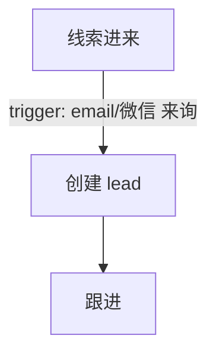

# md2html — Markdown 转 HTML（含 ASCII 流程图自动转 Mermaid）

`md2html` 是 `md2docx` 的姊妹工具，专注做一件事：把 Markdown 设计文档里那些用纯文本/ASCII 手画的流程图，自动识别并转成 `mermaid` 代码块，最终生成可直接在浏览器打开的静态 HTML 页面。

> **范围最小化（A最小）**：目前只处理 ASCII 流程图 → Mermaid，不扩展其他复杂能力。

---

## 特性

- **自动识别 4 种常见 ASCII 流程图写法**：
  - `[节点]` 括号式流程
  - `01 步骤` 编号式流程
  - 含 `域：` 的业务域流程
  - 用 `↓` 连接、可带 `├──` 分支的序列流程
- **一键输出 Markdown**：只替换无语言标记的代码块为 ` ```mermaid `，保留原文档结构。
- **一键输出完整 HTML**：调用 `markdown` 库渲染正文，并自动引入 Mermaid.js。
- **零浏览器依赖**：HTML 在浏览器端由 Mermaid.js 实时渲染，无需本地 Chrome / mmdc。
- **中文友好**：节点文本自动转义，保留 `<br/>` 换行，避免中文标点冲突。

---

## 安装依赖

### 必须

```bash
pip install markdown
```

| 包 | 用途 |
|---|---|
| `markdown` | 渲染 Markdown 为 HTML（`--html` 模式必须） |

### 可选

- 仅输出 Markdown（`--html` 不用）时，可不装任何依赖，纯 Python 标准库即可运行。

---

## 使用方法

```bash
python md2html.py <输入.md> [输出.md]
python md2html.py --html <输入.md> [输出.html]
```

### 示例

```bash
# 1. 只转换 ASCII 流程图为 Mermaid，输出 Markdown
python md2html.py design.md design_with_mermaid.md

# 2. 直接生成完整 HTML 页面
python md2html.py --html design.md design.html

# 3. 自定义页面标题和 Mermaid 主题
python md2html.py --html --title "威廉房产设计文档" --theme default design.md design.html

# 4. 管道用法
cat design.md | python md2html.py > out.md
```

---

## 支持的 ASCII 流程图类型

### 1. 括号式流程

```text
[线索进来]
↓ trigger: email/微信 来询
[创建 lead]
↓
[跟进]
```

转换后：



### 2. 编号式流程

```text
01 启动签约流程
↓ action: 创建 lease
02 出合同
↓
03 合同签署完成
```

### 3. 业务域流程

```text
市场与推广域：引流获客
↓
前台接待域：首次接待 / 预约
↓
销售 CRM 域：深度跟进
```

### 4. 序列分支流程

```text
线索进来
↓
跟进
├── 带看
└── 电话
↓
客户决定租房
```

---

## 文件结构

```
md2html/
├── md2html.py   # 主转换脚本
└── SKILL.md     # WorkBuddy Skill 描述
```

---

## 注意事项

- 输入文件须为 **UTF-8** 编码。
- 仅会处理没有语言标记的 Markdown 代码块（` ``` ` ... ` ``` `）；已有 ` ```mermaid ` 的代码块不会重复转换。
- 若 ASCII 图过于复杂（如大型 PlantUML 图），建议保留 PlantUML 源码或 PNG，不要强行用本工具转换。
- HTML 默认使用 Mermaid.js v10 CDN；如需离线使用，可自行替换模板中的 `<script>` 路径。

---

## 更新日志

### v1.0.0

- 初始版本：ASCII 流程图自动识别并转换为 Mermaid，支持 Markdown / HTML 双输出。
